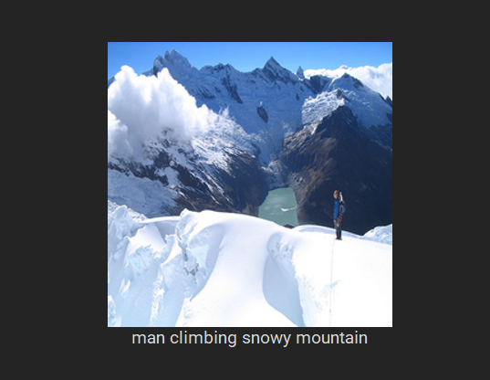
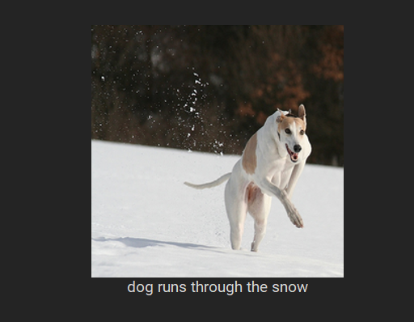

# Image Caption Generation
Neural network with UI. Given image will return the most probable sequence of words describing the image.

# Requirnments
    Keras
    numpy
    tensorflow
    customtkinter
    
# Dataset
The dataset used is Flickr 8k Dataset. You can request the data [here](https://www.kaggle.com/datasets/adityajn105/flickr8k)

### Caption Generation
The input is an image, and the output is a sentence describing the content of the image. It uses a convolutional neural network to extract visual features from the image, and uses a LSTM recurrent neural network to decode these features into a sentence.  This project is implemented using the Tensorflow library.

### Results
* **BLEU-1 = 52.6%**
* **BLEU-2 = 29.6%**

Here are some captions generated by this model:

